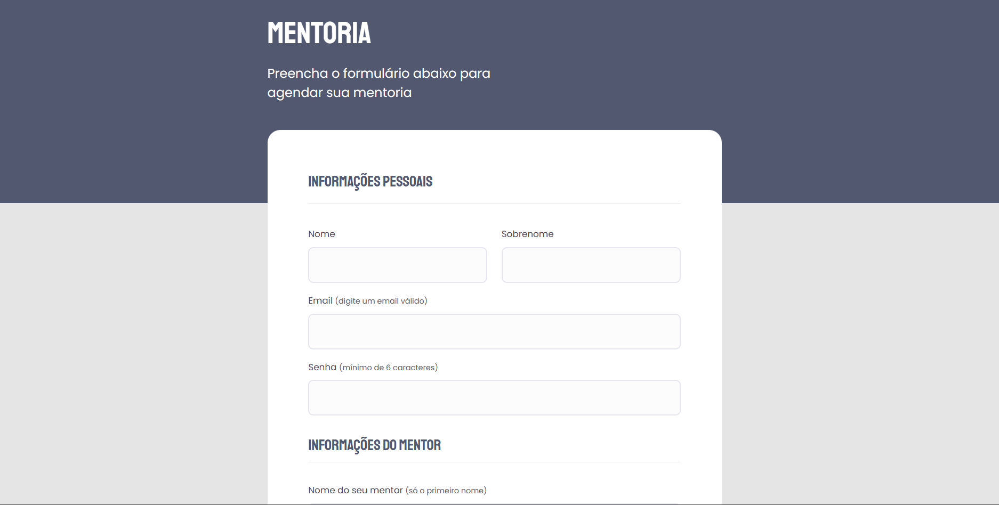
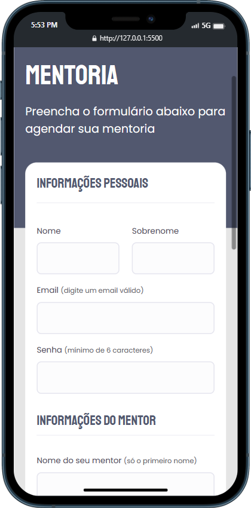

<h1 align=center ><Strong>Formulário para agendamento de mentoria</strong></h1>

 

<strong>Formulário responsivo simulando um agendamento de mentoria<strong>

 

<h1 align=center > </h1>

 

## 🧠 <strong>Tecnologias</strong>

- HTML
- CSS
- FIGMA

 

## 👨‍💻 <strong>Projeto</strong>

 

- Responsivo para dispositivos moveis

 

 

 

- Animações de inicio

 

- Acessibilidade 

 

Este projeto teve como objetivo a consolidação do aprendizado da  criação, semanticação e estilização de formulários usando HTML e CSS.

  

Aqui aprendi a utilização dos seguintes termos: 

- <code>form</code> que serve para escrevermos um formuário de forma semântica e com uma sintaxe correta. Temos o atributo <code>method</code> que determina qual metodo estamos utilizando, não utilizei neste projeto mas tomei conhecimento deles, <code>GET</code>, <code>POST</code>, <code>PUT</code> e <code>PATCH</code>

- <code>fieldset</code> para utilizarmos mais de um <code>input</code> e separarmos cada conjunto de <code>input</code>s para determinado tema. 

## <strong>📑 Layout</strong>

 

 Acesse o layout no figma através [DESSE LINK](https://www.figma.com/file/Nws1KWB7DyXBw8L6wXb9mp/Stage-03---Formul%C3%A1rio-intermedi%C3%A1rio/duplicate). Para sua visualização é necessario ter conta no [Figma](https://www.figma.com/).
